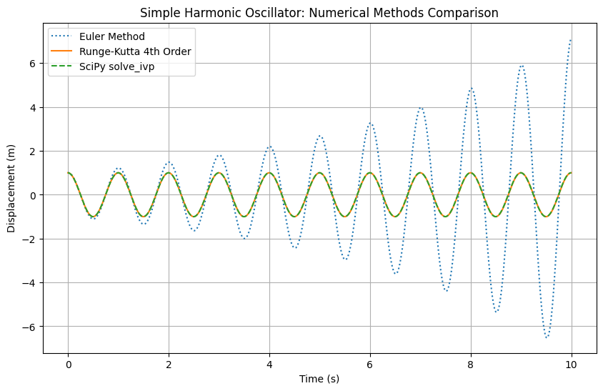
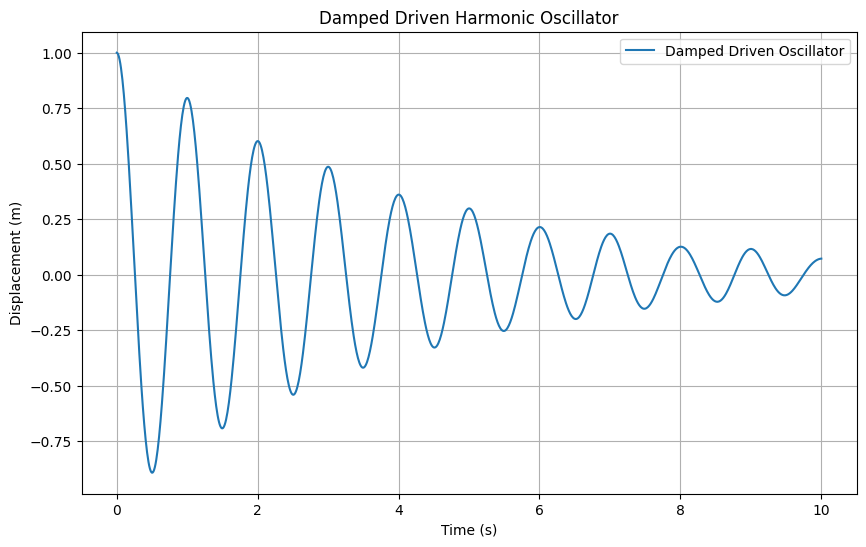

# 🎵 Classic Harmonic Oscillator Simulation

A numerical study of the **classical, damped, and driven harmonic oscillator** — a cornerstone system in both classical and quantum physics.

This project compares different numerical integration methods, analyzes energy behavior, and includes an **interactive simulation** to explore damping and driving forces dynamically.

---

## ⚙️ Features

- 🧮 **Numerical solvers:** Euler, Runge–Kutta 4th Order, and SciPy’s `solve_ivp`  
- 🔋 **Energy analysis:** Kinetic, potential, and total energy evolution  
- 🌊 **Damped & driven oscillator:** Includes damping coefficient and external driving force  
- 🎚️ **Interactive visualization:** Real-time sliders using `ipywidgets`  
- 🔧 **Flexible parameters:** Easily adjustable to explore different physical regimes

---

## 🧠 Background

The harmonic oscillator is one of the most fundamental models in physics, describing systems ranging from a simple spring to quantum mechanical vibrations.

The governing equation: 

$$
\frac{d^2x}{dt^2} + \gamma \frac{dx}{dt} + \omega^2 x = F_0 \cos(\omega_d t)
$$

where:  
- $\omega$: natural frequency  
- $\gamma$: damping coefficient  
- $F_0$: driving force amplitude  
- $\omega_d$: driving force frequency  

💡 **Note:** This system exhibits interesting phenomena such as damping, resonance, and energy exchange between kinetic and potential forms.

---

## 📊 Example Outputs

### 🔹 Comparison of Numerical Methods

### 🔹 Damped Driven Oscillator

---

