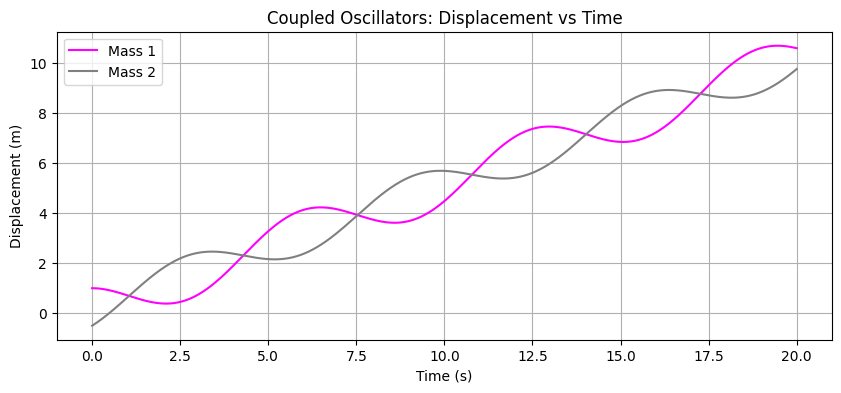
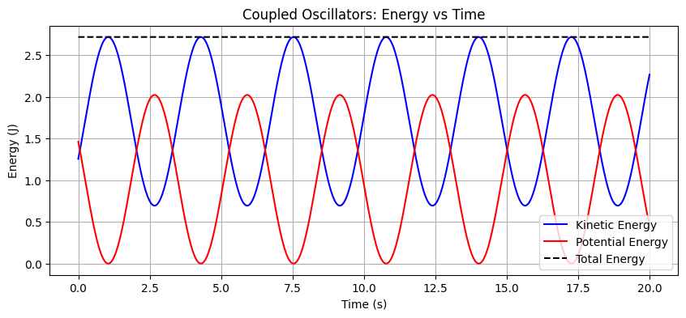
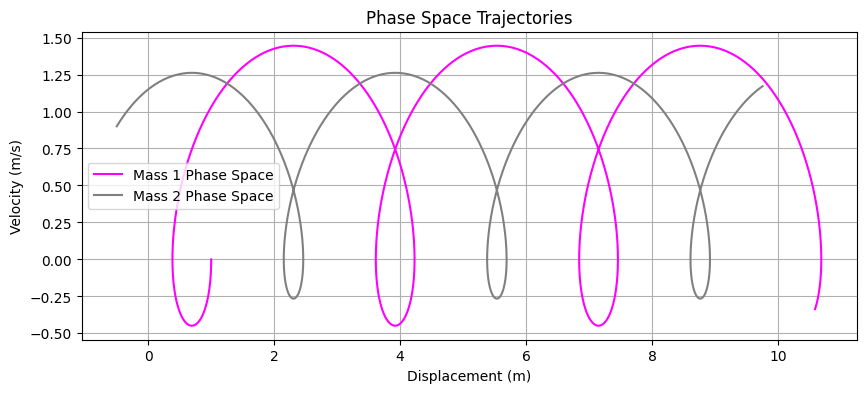
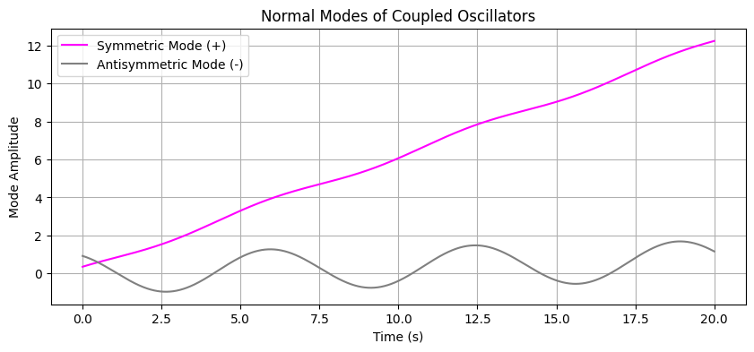

# ⚛️ Coupled Oscillators Simulation

A **computational exploration of two masses coupled by a spring**, modeled using the 4th-order Runge-Kutta (RK4) method.

This project illustrates how **coupled oscillations**, **energy exchange**, **phase-space dynamics**, and **normal modes** emerge in a simple mechanical system. Interactive sliders allow dynamic modification of system parameters.

---

## ⚙️ Features

- 🧮 **Time evolution:** Displacements $x_1(t)$ and $x_2(t)$ for two coupled masses  
- 💡 **Energy analysis:** Kinetic, potential, and total energy vs time  
- 🌐 **Phase-space trajectories:** $(x_i, v_i)$ for each mass  
- 🎨 **Normal modes:** Symmetric and antisymmetric combinations  
- ⚙️ **Interactive sliders:** Modify masses, spring constant, and initial conditions in real time

---

## 🧠 Background

Two coupled oscillators represent a **fundamental problem in classical mechanics and dynamical systems**. The system is governed by the equations of motion:

$$
m_1 \ddot{x}_1 = -k(x_1 - x_2), \quad m_2 \ddot{x}_2 = -k(x_2 - x_1)
$$

Numerical integration with the **4th-order Runge-Kutta method (RK4)** provides high-accuracy solutions for $x_1(t)$, $x_2(t)$ and their velocities $v_1(t)$, $v_2(t)$.

The **normal modes** are obtained as:

$$
x_+ = \frac{x_1}{\sqrt{m_1}} + \frac{x_2}{\sqrt{m_2}}, \quad
x_- = \frac{x_1}{\sqrt{m_1}} - \frac{x_2}{\sqrt{m_2}}
$$

where $x_+$ and $x_-$ correspond to the **symmetric** and **antisymmetric** modes of oscillation.

---

## 📊 Example Outputs

### 🔹 Displacement vs Time

The plot shows the time evolution of the displacements $x_1(t)$ and $x_2(t)$ for each mass.

### 🔹 Energy vs Time

Kinetic, potential, and total energy over time, illustrating energy exchange between the two masses.

### 🔹 Phase-Space Trajectories

Phase-space plots $(x_i, v_i)$ for each mass, showing oscillatory dynamics and stability.

### 🔹 Normal Modes

Symmetric ($x_+$) and antisymmetric ($x_-$) normal modes of the coupled system.

---

## 📝 License
This project is released under the [MIT License](LICENSE).

