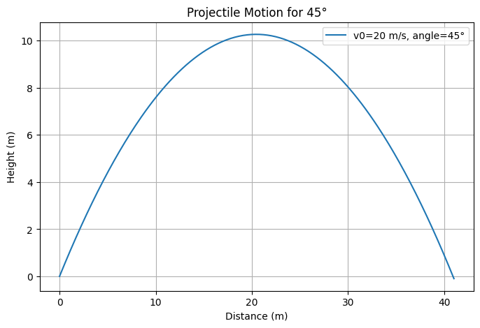
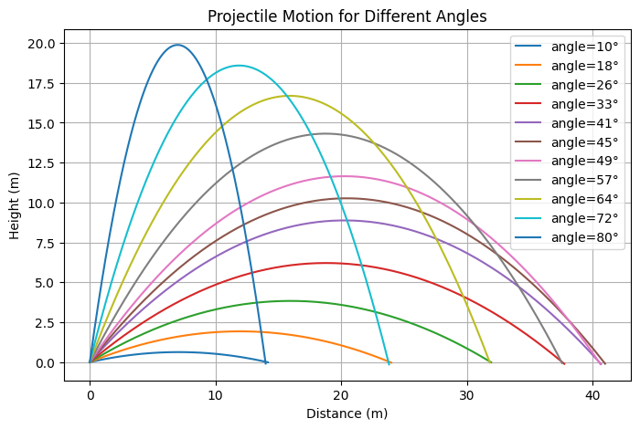

# 🎯 Projectile Motion Simulation

A numerical simulation of 2D projectile motion, exploring trajectories of objects under gravity.
This project demonstrates single and multiple angle launches, allowing visualization of parabolic motion.

---

## ⚙️ Features

- 🧮 **Numerical simulation:** Computes trajectory under gravity
- 📊 **Single trajectory:** Visualize motion for a specific angle (e.g., 45°)
- 🌐 **Multiple trajectories:** Compare different launch angles
- 🎚️ **Interactive potential:** Can be extended with sliders for angle and initial speed

---

## 📊 Outputs

### 🔹 Single Trajectory (45°)

### 🔹 Multiple Trajectories (10°–80°)

---

## 📝 License
This project is released under the [MIT License](LICENSE).

